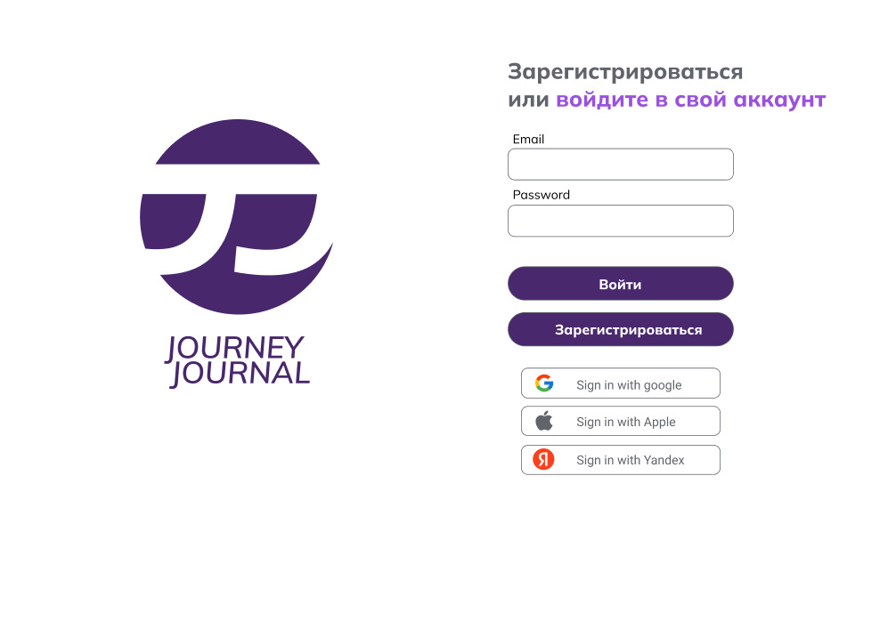
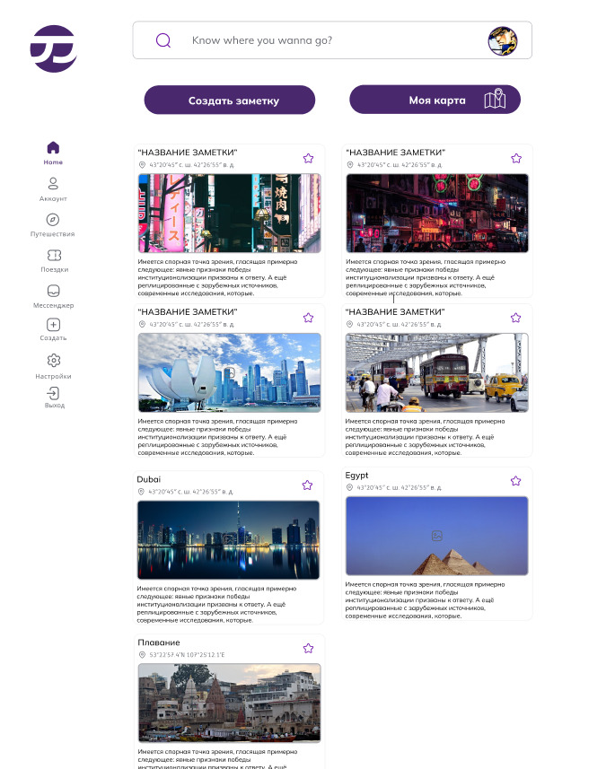
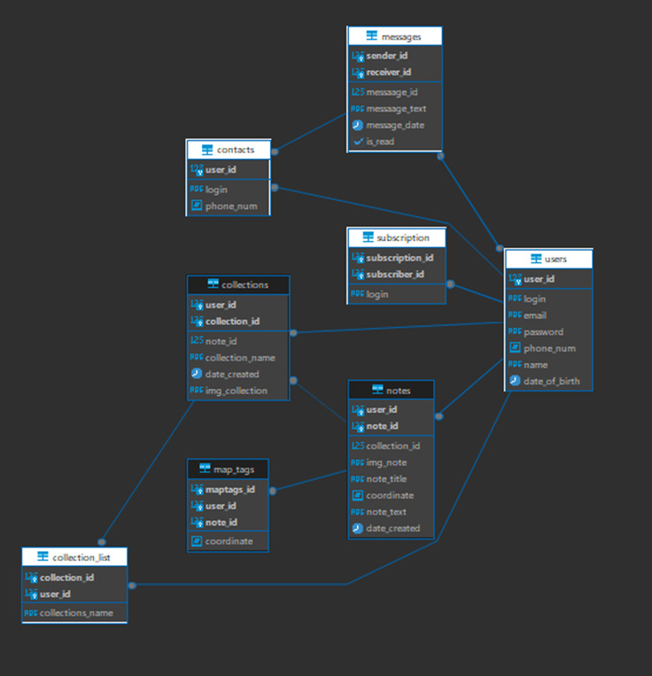

# Journay_Journal_V2

## Выпускная квалификационная работа по специальности «Программирование в компьютерных системах». 

 На тему:  
 «Разработка платформы для социальной сети для коммуникации и взаимодействия пользователей»
 

   
   
  
  

## Работы по проекту, которые были выполнены:
### 1. Определить требования к результату
### 2. Изучение необходимых теоретических материалов
### 3. Подготовка теоретических материалов
### 4. Разработка дизайна в Figma - https://clck.ru/38v3cg
### 5. Разработка логотипа в Adobe Illustrator 

    

###### 6. Использованое ПО:
- Insomnia
- dbeaver
- Visual Studio Code
###### 7. Использованные языки верстки и програмирования:
- HTML  
- SCSS
- TypeScript
- JavaScript
- PostgreSQL 
###### 8. Использованые инструменты:

###### 9. Использованые Библиотеки:
- RxJS
- TypeORM
- ngx-toastr

###### 10. Использованые Фреймворки:
- Angular 17
- Node.js

###### 11. Работы выполненые в рамках Frontend  (Angular 17): 
- Верстка страницы login
- Верстка страницы signup
- Верстка страницы home
- Верстка страницы collection
- Верстка страницы settings
- Верстка страницы createNotes
- Создание Sidebar 

<!-- Верстка модального окна:
    - Модального окна "Создание заметки",
    - одального окна "Моя карта",
    - Модального окна "Создание подборки" -->

###### 12. Работы выполненые в рамках Backend (Node.js): 

###### 13. Разработка Базы Данных СУБД PostgreSQL 

     

  

- Подключение базы данных
- Регистрация пользователей
- Валидация данных 
- Авторизация пользователей
- Collection - Создание, удаление, редактирование.
- Notes- Создание, удаление, редактирование.

- Связывание логики верификации и регистрации с интерфейсом
- Переходы между страницами верификаци  регистрации и страницы пользователя

**Автор этого репозитория - [ Zotov Oleg (Helgeee) ](https://github.com/Helgeee).**